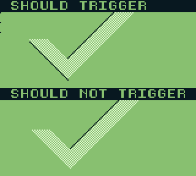

# little-things-gb
Small test ROMs and experiments for Gameboy made by nitro2k01. Inspired by [PinoBatch's repo](https://github.com/pinobatch/little-things-gb) with the same name and concept. 

## Building
Prerequisite: some recent version of RGBDS. Under Linux and presumably macOS, just run `./m.sh`. No Makefile, sorry. Maybe one day. Under Windows it should not be too hard to make a `m.bat` file that executes the same commands as `./m.sh`.

# List of projects

## Whichboot.gb (2022)

Whichboot.gb is a research tool for identifying Gameboy consoles and emulators through software running on the machine/emulator. It is similar in concept to [Matt Currie's which.gb](https://github.com/mattcurrie/which.gb) but it's using different detection mechanisms and is geared toward detecting different aspects of the running machine than which.gb. Whereas which.gb is trying to detect which SoC revision the ROM is running on by triggering various hardware quirks, whichboot.gb is trying to detect which boot ROM was executed. It does this by detecting the CPU register values left by the boot ROM, as well as the timing of the boot process using `DIV` and `LY`, and the logo data left in VRAM. 

The initial purpose of this tool was to provide a non-intrusive way of detecting any undumped boot ROMs that may exist in Gameboy clones. However, it also turned out to be a powerful tool for finding out interesting information about the design process and internal workings of various emulators. I have run whichboot.gb on a wide range of new and old emulators, and using just the methods described below, it can accurately detect many of the older emulators exactly.

Originally destined for little-things-gb, this project now has [its own repo](https://github.com/nitro2k01/whichboot.gb).

## Windesync-validate (2022)

An emulator validation test ROM for a hardware quirk on pre-GBC Gameboys where activating the window, then turning it off on a later scanline inserts a glitch pixel and offsets the rest of the scanline, depending on the values of `SCX` and `WX`. Recently (re-)discovered because a graphical element in the game Star Trek 25th Anniversary was misaligned by one pixel in emulators. At the time of writing, the only emulators known to emulate this quirk are [BGB](https://bgb.bircd.org/) and [SameBoy](https://sameboy.github.io/).
