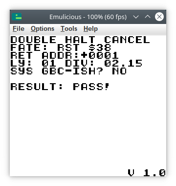

# Double-halt-cancel

A test ROM that tests what happens if a program executes a double `halt` instruction with interrupts disabled, then changes the data at the location in question. It is conventionally assumed that executing a double `halt` will permanently lock up the CPU. What actually happens on hardware though, is that the CPU keep reading the second `halt` instruction over and over. If the CPU would theoretically read a different value all of a sudden, this code would be allowed to run instead. This could be done using a custom cartridge that can switch ROM banks automatically in the background. However, this test ROM uses VRAM inaccessibility to execute a `rst $38` instruction when VRAM becomes inaccessible and reads `$FF`.

## Building
Prerequisite: some recent version of RGBDS. Under Linux and presumably macOS, just run `./m.sh`. No Makefile, sorry. Maybe one day. Under Windows it should not be too hard to make a `m.bat` file that executes the same commands as `./m.sh`.

## Download
If you are just looking for the ROM, go to [releases](https://github.com/nitro2k01/little-things-gb/releases/).

## Hardware theory 

### The `halt` bug

The `halt` bug is a hardware bug in the SM83 CPU that happens when `halt` is executed with `IME==0`, that is after disabling interrupts using `di`. The bug is usually explained as duplicating the next byte in the instruction pipeline. 

Consider the following example:

```asm
ADDR DATA     INSTRUCTIONS
0000 76       halt
0001 04       inc B
```

In this simple example, if the bug were triggered, `B` will be incremented twice. But it is not a simple repetition of one instruction; one byte is being repeated. Consider this example:

```asm
ADDR DATA     INSTRUCTIONS
0000 76       halt
0001 06 04    ld B,4
```
In this example, the byte `$06` is read twice, and the CPU effecetively sees this stream of data:

```asm
ADDR DATA     INSTRUCTIONS
0000 76       halt
0001 06 06    ld B,6
0002 04       inc B
```
Meaning that, in the end, `B==7`.

But the pattern doesn't always hold. An instruction like `ret` appears to be working normally. The instruction group `rst $xx` (a one byte shorthand call with a list of fixed vectors) finally reveals the internal workings of the CPU. `rst $xx` is not executed twice in a row. Instead the return address pushed to the stack is in fact the same address as the instruction itself. 

```asm
ADDR DATA     INSTRUCTIONS
0000 76       halt
0001 CF       rst $08
```
In this example, the `rst $08` instruction will not push `$0002` to the stack as its return address as one might expect, but instead `$0001`. If the `rst` vector would return naïvely using `ret`, it would indeed execute a second time. However, code in general need not return if it doesn't want to[^1] and double execution is by no means guaranteed.

So, we can finally see what the `halt` bug actually is: it's an inhibition of the automatic incrementation of PC, meaning in this case that the previous value of `PC` would be pushed to the stack.

[^1]: It might seem like a stretch that a call to a `rst` vector would not return. However, a fairly common pattern is to use an `rst` for jump tables, where the return address is `pop`ped from the stack and used as the base address for the jump table immediately following the `rst` instruction. Doing this after a `halt` instruction is likely, though.

### The double `halt` bug

So, finally, the double `halt` bug. Executing the following instructions with interrupts disabled is supposed to lock up the CPU:

```asm
ADDR DATA     INSTRUCTIONS
0000 76       halt
0001 76       halt
```
What actually happens under the hood is that the second `halt` is executed repeatedly, because the PC increment inhibition stops the CPU from moving past that point. Under normal circumstances this would *effectively* lock up the CPU, since there's nothing "normal" that can cause the CPU to leave the deadlock at this point. The exception of course being if the data at address `$0001` is suddenly changed.

This is where VRAM accessibility comes in: Load some code into VRAM. Jump to it while VRAM is accessible, for example in HBlank. Wait until VRAM becomes inaccessible and reads `$FF`. Since `$FF` happens to correspond to the instruction `rst $38`, we can catch execution from there and print some data on the screen.

## Principle of operation

### Sequence of operations

In summary, the test does the following steps:

1. __Prepare some graphics in VRAM.__ This is done beforehand, to allow the ROM show something in case test code would lock up. (Like it does on some emulators.)
2. __Copy the test code to VRAM.__
3. __Reset `DIV` by writing to it, and enable `LCDC`.__ This sets up a way to measure cycle accurate execution timings, with the enabling of `LCDC` as the starting point.
4. __Wait for VRAM to be accessible and jump to the test code.__
5. __Manually request an interrupt and run a double `halt`.__ Set the appropriate bits in `IE` and `IF` to trigger an interrupt to keep the double `halt` spinning for a while.
6. __Trap execution.__ The test ROM has prepared traps at various places to catch different possible scenarios for the execution path.
7. __Collect and display data.__ Detect which execution path was taken (assuming no lockup) and measure the exact `DIV` timing using the method from [whichboot.gb](https://github.com/nitro2k01/whichboot.gb).

### Trap points

The code copied to VRAM looks like this. It is designed to trap various possible execution that may happen in an inaccurate emulator.

```asm
LOAD "VRAM code", VRAM[$9C00]
HALT_TEST_VRAM:
	ld	A,IEF_STAT
	ldh	[rIE],A
	ld	A,IEF_STAT|IEF_VBLANK
	ldh	[rIF],A
;	xor	A
;	ldh	[rDIV],A
.halts
	halt
	halt
	jr	@+2
	; If 
.after_jr
	call	HANDLE_RESULT
.retaddr_normal_jr
	ds	$18-@+.after_jr,0
.jr_double_bug
	call	HANDLE_RESULT
.retaddr_bugged_jr
.end
ENDL
```

1. __VRAM inaccesibility producing `rst $38`__ This is the correct execution path on hardware. When VRAM goes inaccessible, `$FF` which corresponds to the instruction `rst $38`, is executed. This trap is located at `$0038`.
2. __Halted!__ A message is shown on screen by default which remains if the code would lock up forever.
3. __LCD interrupt.__ An LCD interrupt is manually requested, and LCD interrupts are enabled in `IE`. This checks for emulators that dispatch an interrupt call even though `IME==0`, when `halt` is executed. Many older emulators emulate the `halt` instruction based on a misunderstanding. The Z80's `halt` instruction will lock up the CPU if executed with interrupts disabled with `di`. The Gameboy CPU on the other hand was reported early on to allow execution of interrupts despite this. Some early emulators took this to mean that the interrupt vector is executed, when in fact it just falls through when an interrupt is triggered. This trap is located at the LCD interrupt vector, `$0048`.
4. __VBlank interrupt.__ A VBlank interrupt is manually requested, but as the keen-eyed reader might have noticed, the VBlank interrupt is not even enabled in `rIE`. As above, but checks for any emulator that might additionally completely ignore `rIE` when `halt` is executed, and always execute the highest priority interrupt. This trap is located at the VBlank interrupt vector, `$0040`.
5. __Fallthrough, non-bugged `jr`.__ Immediately following the second halt is a `jr` instruction which jumps to the address right after itself. If the code resumes after the second `halt` and without the bug, this execution path is taken.
6. __Fallthrough, bugged `jr`.__ This exists to cover the case that the `jr` gets the double read bug. The CPU would then read `$18 $18` where the first `$18` is the opcode for `jr` and the second `$18` is interpreted as a jump forward `$18` steps. 

Some of these are (pre-emptively) more likely than others, but this should cover all reasonable, and most unreasonable execution paths that the double `halt` bug might produce in an inaccurate emulator.

## Note on emulators

To emulate the glitch and pass this test ROM, an emulator needs to emulate a few things:

- Correct emulation of `halt`, re-reading the memory of the second `halt` instruction over and over.
- Correct emulation and timing of VRAM inaccessibility, even for code executing in VRAM, and not just writes/reads.
- Correct emulation and timing of `DIV`, including the ability to reset it by writing to it.

### BGB, SameBoy, Gambatte (Correct emulation)

 

BGB (as of 1.5.10), SameBoy (as of 0.15.1) and Gambatte (as of gambatte-speedrun r745) all produce the correct result.

### Emulicious (almost correct emulation)

 

Emulicious (as of 2022-12-11) overall has the capability to emulate this bug and passes in DMG mode, but is 1 cycle off timing wise in GBC mode. My theory is that VRAM becomes inaccessible for reads 1 cycle later on GBC, and that Emulicious doesn't emulate this particular timing exactly. (This should be testable without a ROM that relies on `halt` and execution in VRAM.)

### Beaten Dying Moon (almost correct emulation)

 

Beaten Dying Moon (as of 2022-12-11) just like Emulicious overall emulates this bug, but doesn't emulate the 1 cycle difference present on GBC.

### mGBA (almost correct emulation)

 

mGBA (as of 0.10-7675-83f0deab1-dirty) has the same one cycle difference in GBC mode as the previous two emulators.

### VisualBoyAdvance-M (almost correct emulation)

 

VBA-M (as of v 2.1.4-13c558ac) is almost correct but slightly worse than the previous entries: the timing of both DMG and GBC are off by one.

### binjgb

binjgb, as of `df9e883` (2022-11-17) hangs when subjected to a double halt. (The whole application, not the running ROM.)

### no$gmb

 

no$gmb warns about double `halt` locking up the CPU. If you continue anyway, it executes the `jr` with the `halt` bug applied. (See **Fallthrough, bugged `jr`** above in the list of explanations.)

During this test I also discovered a couple more oddities about no$gmb's emulation.

- The `DIV` register is reset to `FF` instead of `00` when written to.
- The `DIV` register counts down instead of up.
- no$gmb is using tiles $10-$28 instead of $01-$19, which is the source of dirt graphics. (I apparently didn't clear the tilemap in VRAM. Oops, and thanks no$gmb for exposing ths through its inaccuracy!)

### VisualBoyAdvance


VBA "classic" (v 1.8.0-beta 3) locks up the CPU, in both DMG and GBC mode.

### KiGB

 

KiGB apparently makes no attempt at emulating the double `halt` bug and falls through.

### Gest


Gest (as of v 1.1.1) locks up the CPU, in both DMG and GBC mode.

### HGB


HGB is an obscure, older emulator last updated in 1999. HGB (as of v110309+) falls through and appears to not emulate the `halt` bug at all.

### rew.


rew. is another obscure, old emulator. It triggers an LCD interrupt after the first `halt`.

### TGB Dual


TGB Dual is yet another older emulator, last updated in 2001. It triggers an LCD interrupt after the first `halt`.

## Version history

### Version 1.0 (2022-12-10)

First public release with source.
