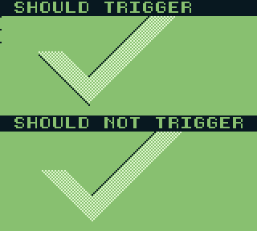

# Windesync-validate

Windesync is a validation ROM for emulator authors wishing to implement a certain harware quirk present on pre-GBC Gameboys, and (re-)discovered because some graphics in a screen in the game *Star Trek 25th Anniversary* were misaligned by one pixel in emulators.

If a program running on the Gameboy first triggers displaying the window at some point during a frame, then hides the window by clearing `LCDCF_WINON`, then the PPU will produce a glitch pixel where the window would have started drawing on that line, under the condition `(WX&7)==7-(SCX&7)`. Windesync-validate is setting `SCX` and `WX` to various test values throughout the frame, and uses the offset and glitched pixels to draw a recognizable image.

At the time of writing, the only emulators known to emulate this quirk are [BGB](https://bgb.bircd.org/) and [SameBoy](https://sameboy.github.io/).

## Building
Prerequisite: some recent version of RGBDS. Under Linux and presumably macOS, just run `./m.sh`. No Makefile, sorry. Maybe one day. Under Windows it should not be too hard to make a `m.bat` file that executes the same commands as `./m.sh`.

## Download
If you are just looking for the ROM, go to [releases](https://github.com/nitro2k01/little-things-gb/releases/).

## Summary of the glitch
The following applies only to pre-GBC hardware. It may reportedly be dependent on the SoC revision and LCD, although from what I've seen so far this seems unlikely.

When the window is disabled after it has been activated once by a `WY`/`WX` hit, there's an extra pixel inserted on every subsequent line if a number of conditions are true. 

* The window is currently disabled.
* A `WX` hit happens, which requires `0<=WX<=$A6`.
* The values of `WX` and `SCX` line up in a certain way. You could describe this in different ways. Mathematically, you could describe the condition as `(WX&7)==7-(SCX&7)`. More visually, you could describe it as "if the SCX scroll position would draw the leftmost pixel of a tile on the same pixel as the window would start drawing (if it was enabled) this pixel becomes glitched".

The effect of this glitch is that a pixel that becomes glitched is output as a pixel colored with BG palette entry 0. (That is, the color described by bits 0 and 1 of `BGP`. The rest of the line is delayed and shifted one pixel to the right.

You can find some more details, as well as a logic analyzer data dumps on [SameBoy issue 278](https://github.com/LIJI32/SameBoy/issues/278).

### Avoiding this glitch in your own game
If you are a Gameboy programmer who runs into this glitch, it's recommended to set `WX` to a value off-screen (`>167`) when the window is disabled, to avoid the glitch altogether. This method was for example employed by Elmar Krieger in *Prehistorik Man* and you can probably find other examples of games who found this solution if you dug through the game library with a teaspoon. 

 

However, the authors of *Star Trek 25th Anniversary,* the game that prompted adding support for the glitch in emulators, and making this test ROM, did not find this solution. This game instead elected to modify its graphics to shift some of the graphics by 1 pixel to compensate for the glitch, and live with the fact that there was a black line at the left side of the screen.

## Test ROM principle of operation

A challenge in making this test ROM was to display the success/failure of the test in a way that is visually clear, given the limitations of the hardware quirk itself. I wanted to draw a checkmark to indicate a successful test, while at the same time testing a number of different combinations of `SCX` and `WX`. 

The way I did this in the end was by creating a slanted version of a checkmark and un-slanting it by changing the value of `SCX` every scanline. This gave a good sample of `SCX` test values. 

Additionally the glitch pixels are used for creating part of the shadow under the checkmark.

There's also a second line that turns the checkmark into a cross (X). All of these graphics are filled with a checkerboard pattern. This allows them to be shown/hidden using sprites which are also have a checkerboard pattern, that can selectively mask parts of the graphics depending on whether they are offset by 1 pixel.

## How to validate the emulator output using this ROM

This is the reference image for the test output. It was digitally captured from my Super Gameboy using a Saleae logic analyzer clone and then converted to an image, and thus represents a reference for correct output from hardware.

The test consists of two sections, "should trigger" and "should not trigger". 

### Should trigger, top part

"Should trigger" represents combinations of `SCX` and `WX` where the glitch should trigger. The topmost part of this section is drawing part of the checkmark by triggering glitch pixels to the left of the visible area of the screen. Note however that this is not possible for some values of `SCX`, so three glitch pixels are shown in the leftmost column of this section, which are part of the correct output from the test. All BG graphics are shifted on pixel to the right in this section. The drop shadow in this section is hardcoded graphics, not drawn using glitch pixels.

If the BG graphics are not shifted, the sprites will reveal a second line, forming a cross. This indicates a failed test.

### Should trigger, bottom part

This part of the screen is using the glitched pixels as a drop shadow to the left of the left line of the checkmark. (The drop shadow on the right line of the checkmark is hardcoded and not using glitch pixels.) All BG graphics to the right of the glitched pixels are shifted one pixel to the right in this section.

### Should not trigger

This part of the screen represents combinations of `SCX` and `WX` where the glitch should not trigger. Note that this checkmark should *not* have a drop on the left side. The "should not trigger" portion should appear correct on any emulators that implements the glitch correctly, as well as on any emulators that don't attempt to implement it at all. This section is included to detect false positives in emulators while implementing the glitch.

### Examples of test failures

 

This is an image of typical output from an emulator that does not implement this glitch. The image to the right shows the same scenario with GBC colorization, which reveals the sprites that are used to to selectively hide/show graphics in the BG layer depending on whether the BG layer is shifted 1 pixel from the glitch or not. (GBC does not have the glitch, so technically this would not be a failure. :) )

This image shows an incorrect implementation of the glitch in SameBoy during development of support for the glitch. Apart from the more visually obvious issue, the glitch pixels are also misaligned by 1 pixel. Reference on the left, SameBoy on the right.

 

### Limitations of the test ROM

One limitation is that it doesn't exhaustively check every combination of `SCX` and `WX`. This would not be possible in a ROM that shows a single static image. Another limitation is that it modifies `SCX` and `WX` in the HBlank period and does not attempt to test timing behavior of writing to IO registers close to the point in time where the glitch would happen. Yet another limitation is that this ROM does not other colors than black for the glitch pixel, meaning that an emulator that drew glitch pixels as black instead of the color 0 in BGP would appear to pass.

## Version history

### Version x.x (2022-07-20, 2022-07-22)
Versions posted initially when beware and Liji were implementing this issue in BGB and SameBoy.

### Version 1.0 (2022-12-07)
First public release with source. Almost identical to the initial version, except the the left side of the checkmark now also has sprites, to reveal a potential emulation issue where the output looks almost correct but the glitch is offset by one pixel. (See Examples of test failures)
